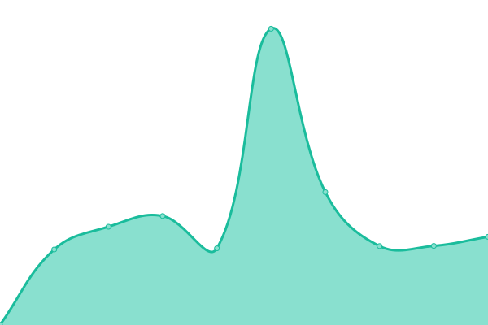

# [📈 Live Status](https://fernandocarballo.github.io/ozono_upptime): <!--live status--> **Todos los sistemas estan operacionales**

This repository contains the open-source uptime monitor and status page for [Fernando Carballo](https://fernandocarballo.github.io/ozono_upptime), powered by [Upptime](https://github.com/upptime/upptime).

With [Upptime](https://upptime.js.org), you can get your own unlimited and free uptime monitor and status page, powered entirely by a GitHub repository. We use [Issues](https://github.com/fernandocarballo/ozono_upptime/issues) as incident reports, [Actions](https://github.com/fernandocarballo/ozono_upptime/actions) as uptime monitors, and [Pages](https://fernandocarballo.github.io/ozono_upptime) for the status page.

<!--start: status pages-->
<!-- This summary is generated by Upptime (https://github.com/upptime/upptime) -->
<!-- Do not edit this manually, your changes will be overwritten -->
<!-- prettier-ignore -->
| URL | Status | History | Response Time | Uptime |
| --- | ------ | ------- | ------------- | ------ |
|  [Santo Tome Nextcloud](http://santotomeserver.no-ip.info/) | En linea | [santo-tome-nextcloud.yml](https://github.com/fernandocarballo/ozono_upptime/commits/HEAD/history/santo-tome-nextcloud.yml) | 

 817ms
     
 | 

<a href="https://fernandocarballo.github.io/ozono_upptime/history/santo-tome-nextcloud">73.86%</a>
    

|  [Santo Tome Tomcat](http://santotomeserver.no-ip.info:8080) | En linea | [santo-tome-tomcat.yml](https://github.com/fernandocarballo/ozono_upptime/commits/HEAD/history/santo-tome-tomcat.yml) | 

 1629ms
     
 | 

<a href="https://fernandocarballo.github.io/ozono_upptime/history/santo-tome-tomcat">94.93%</a>
    

|  [Yersoncred Tomcat](http://serveryersonalvear.ddns.net:8080) | En linea | [yersoncred-tomcat.yml](https://github.com/fernandocarballo/ozono_upptime/commits/HEAD/history/yersoncred-tomcat.yml) | 

 358ms
     
 | 

<a href="https://fernandocarballo.github.io/ozono_upptime/history/yersoncred-tomcat">100.00%</a>
    

|  [Fenixcred Tomcat](http://fenixcred.noip.us:8080) | En linea | [fenixcred-tomcat.yml](https://github.com/fernandocarballo/ozono_upptime/commits/HEAD/history/fenixcred-tomcat.yml) | 

 395ms
     
 | 

<a href="https://fernandocarballo.github.io/ozono_upptime/history/fenixcred-tomcat">100.00%</a>
    

|  [Ozono Odoo](https://ozonotest.ddns.net/) | En linea | [ozono-odoo.yml](https://github.com/fernandocarballo/ozono_upptime/commits/HEAD/history/ozono-odoo.yml) | 

 554ms
     
 | 

<a href="https://fernandocarballo.github.io/ozono_upptime/history/ozono-odoo">100.00%</a>
    

|  [Lo+Hot Odoo](http://lomashotcentral.no-ip.info:8069) | En linea | [lo-hot-odoo.yml](https://github.com/fernandocarballo/ozono_upptime/commits/HEAD/history/lo-hot-odoo.yml) | 

 473ms
     
 | 

<a href="https://fernandocarballo.github.io/ozono_upptime/history/lo-hot-odoo">89.70%</a>
    

|  [Oregon Odoo](http://serveroregon.ddns.net:3080) | En linea | [oregon-odoo.yml](https://github.com/fernandocarballo/ozono_upptime/commits/HEAD/history/oregon-odoo.yml) | 

 370ms
     
 | 

<a href="https://fernandocarballo.github.io/ozono_upptime/history/oregon-odoo">100.00%</a>
    

<!--end: status pages-->

[**Visit our status website →**](https://fernandocarballo.github.io/ozono_upptime)

## 📄 License

- Powered by: [Upptime](https://github.com/upptime/upptime)
- Code: [MIT](./LICENSE) © [Fernando Carballo](https://fernandocarballo.github.io/ozono_upptime)
- Data in the `./history` directory: [Open Database License](https://opendatacommons.org/licenses/odbl/1-0/)
